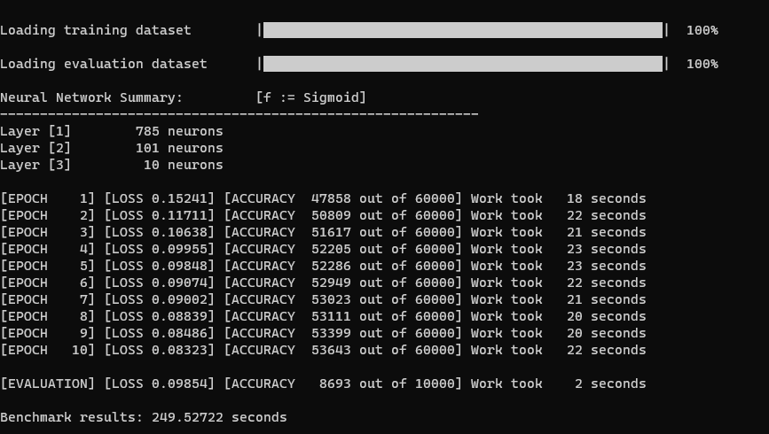

# Neural Network

In this repository, there is a simple implementation of a feed forward multi-layer Neural Network from scratch. The project specifications are listed below:
* Programming Language: *C++ 17*
* Optimization framework: *OpenMP 5.1*

This implementation runs on the system's __CPU__ in parallel. The model was tested using the [Fashion MNIST](https://www.kaggle.com/zalando-research/fashionmnist/data) dataset.

## Installation

* Open a terminal
* Clone the repository `git clone https://github.com/andreasceid/neural-network.git`
* Change directory using `cd neural-network/`
* Compile the project using  `make`
* Create the dataset directory using  `mkdir data`
* Extract the CSV files found on [Kaggle](https://www.kaggle.com/zalando-research/fashionmnist/data) in  `data` directory created before
* Execute the project:
    * To execute the project using the default settings, use `make run`
    * To execute the project using custom model architecture:
        * Change directory using `cd build`
        * Use `./Neural-Network -i <int> -h <int> [-h <int> ...] -o <int>`
        
            For example `./Neural-Network -i 784 -h 150 -h 100 -h 50 -o 10`

To rebuild the project, use  `make clean`  first and then execute  `make`  and  `make run`.

To compile using the Intel Compiler in a Windows environment, use: `icl Accuracy.cpp Activation.cpp Dataset.cpp Driver.cpp Export.cpp Fit.cpp Forward.cpp Interface.cpp Loss.cpp Optimize.cpp Parser.cpp Utilities.cpp /Qopenmp /Qunroll /Qipo /O3 /Ot /GT /Ob2 /Oi /GA /fp:precise /QxHost /Qstd:c++17 /FeNeural-Network.exe`

## Model Settings

The model's settings are:
* Number of epochs: **100**
* Activation function: **Sigmoid**
* Loss function: **MSE**
* Learning rate: **0.1**

With these settings, the training is expected to last around *25 minutes* running on a medium to high end machine. 

## Fine tuning

In `Common.hpp` there are parameters that can be tuned for better results. For example, there is a variable called  `N_THREADS`  that holds the nubmer of threads to request from the OS. This number is recommended to be equal to the number of the system's  *logical cores*. Furthermore, in this file the user can edit the number of  *epochs*  of training for faster results and the model's  *learning rate*. 

## Results 

The effective core utilization percentage was around 97 %. An example of execution is: 

Below, there are multiple model architecures compared for research purposes using the fashion MNIST dataset:

|  Model ID 	| First Hidden Layer 	| Second Hidden Layer 	| Third Hidden Layer 	| Activation Function 	| Epochs 	| Learning Rate 	| Accuracy 	|   loss  	|
|:---------:	|:------------------:	|:-------------------:	|:------------------:	|:-------------------:	|:------:	|:-------------:	|:--------:	|:-------:	|
|     1     	|         100        	|          0          	|          0         	|       Sigmoid       	|   10   	|      0.3      	|   83.03  	| 0.14044  	|
|     1     	|         100        	|          0          	|          0         	|       Sigmoid       	|   10   	|      0.1      	|   87.04  	| 0.10050 	|
|     2     	|         100        	|          0          	|          0         	|       Sigmoid       	|   100  	|      0.1      	|   88.73  	| 0.09244 	|
|     3     	|         100        	|          50         	|          0         	|       Sigmoid       	|   10   	|      0.3      	|   85.63  	| 0.10826  	|
|     4     	|         100        	|          50         	|          0         	|       Sigmoid       	|   100  	|      0.1      	|   88.10 	| 0.09333 	|
|     5     	|         150        	|         100         	|         50         	|       Sigmoid       	|   10   	|      0.3      	|   86.43  	| 0.09927  	|
|     6     	|         150        	|         100         	|         50         	|       Sigmoid       	|   100  	|      0.1      	|   88.05 	| 0.09404  	|
|     7     	|         150        	|         100         	|         50         	|       Sigmoid       	|   100  	|      0.01     	|   88.18 	| 0.09303 	|
|     8     	|         150        	|         100         	|         50         	|       Sigmoid       	|   1000  	|      0.01     	|   88.33 	| 0.10240 	|

It's worth to mention that for the eighth model, the training accuracy was around 59200 out of 60000 and had a training loss equal to 0.00967. This means that for a feed - forward model, a test accuracy of 90 % on the test subset of the fashion MNIST dataset is a ceiling.

## Notes

There is a [project report](lab4-neural-network.pdf) in Greek.
