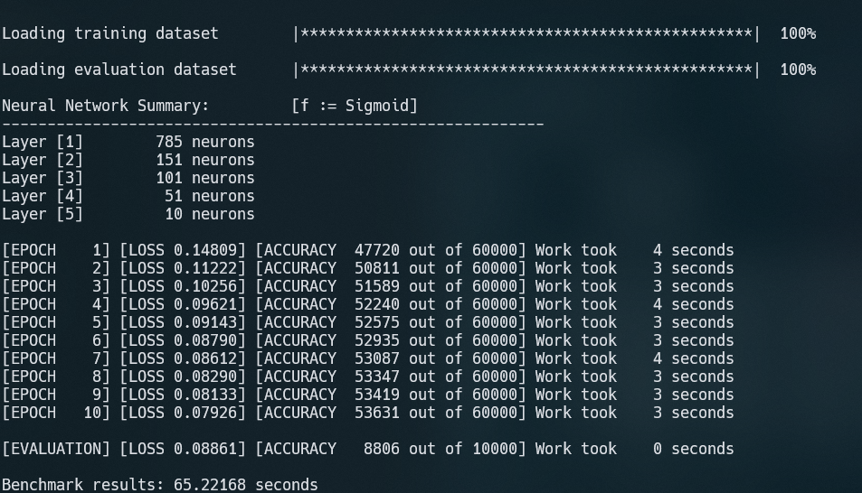

# Feed Forward Neural Network in C++ 17

In this repository, there is a simple implementation of a feed forward multi-layer Neural Network from scratch. The project specifications are listed below:
* Programming Language: *C++ 17*

This implementation runs on the system's __CPU__ in serial mode. The model was tested using the [Fashion MNIST](https://www.kaggle.com/zalando-research/fashionmnist/data) dataset.

## Prerequisites

On Windows OS, the installation used `Intel OneAPI`, which is available for all University Students. On Linux, the installation is straight forward. There is a `makefile` that can be used to build the project on any Linux distribution.

## Installation

* Open a terminal
* Clone the repository `git clone https://github.com/AndreasKaratzas/ece572.git`
* Compile the project using `make`
* Create the dataset directory using `mkdir data`
* Extract the CSV files found on [Kaggle](https://www.kaggle.com/zalando-research/fashionmnist/data) in  `data` directory created before
* Execute the project:
     * Change directory using `cd build`
     * Use `nn.out -i <int> -h <int> [-h <int> ...] -o <int>`

         For example `nn.out -i 784 -h 150 -h 100 -h 50 -o 10`

To compile using the Intel Compiler in a Windows environment, use: 
```powershell
icx main.cpp src/accuracy.cpp src/activation.cpp src/dataset.cpp src/export.cpp src/fit.cpp src/forward.cpp src/interface.cpp src/loss.cpp src/optimize.cpp src/parser.cpp src/utilities.cpp /Ilib /Qopenmp /Qunroll /Qipo /O3 /Ot /Ob2 /Oi /GA /fp:precise /QxHost /Qstd:c++17 /Fenn.exe
```

Then, to execute, use:
```powershell
nn.exe -i 784 -h 150 -h 100 -h 50 -o 10
```

## Model Settings

The model's settings are:
* Number of epochs: **100**
* Activation function: **Sigmoid**
* Loss function: **MSE**
* Learning rate: **0.1**

With these settings, the training is expected to last around *17 minutes* running on a medium to high-end machine. 

## Fine tuning

In `common.hpp` there are parameters that can be tuned for better results.

## Results 

An example of execution is: 



Below, there are multiple model architectures compared for research purposes using the fashion MNIST dataset:

|  Model ID 	| First Hidden Layer 	| Second Hidden Layer 	| Third Hidden Layer 	| Activation Function 	| Epochs 	| Learning Rate 	| Accuracy 	|   loss  	|
|:---------:	|:------------------:	|:-------------------:	|:------------------:	|:-------------------:	|:------:	|:-------------:	|:--------:	|:-------:	|
|     1     	|         100        	|          0          	|          0         	|       Sigmoid       	|   10   	|      0.3      	|   83.03  	| 0.14044  	|
|     1     	|         100        	|          0          	|          0         	|       Sigmoid       	|   10   	|      0.1      	|   87.04  	| 0.10050 	|
|     2     	|         100        	|          0          	|          0         	|       Sigmoid       	|   100  	|      0.1      	|   88.73  	| 0.09244 	|
|     3     	|         100        	|          50         	|          0         	|       Sigmoid       	|   10   	|      0.3      	|   85.63  	| 0.10826  	|
|     4     	|         100        	|          50         	|          0         	|       Sigmoid       	|   100  	|      0.1      	|   88.10 	| 0.09333 	|
|     5     	|         150        	|         100         	|         50         	|       Sigmoid       	|   10   	|      0.3      	|   86.43  	| 0.09927  	|
|     6     	|         150        	|         100         	|         50         	|       Sigmoid       	|   100  	|      0.1      	|   88.05 	| 0.09404  	|
|     7     	|         150        	|         100         	|         50         	|       Sigmoid       	|   100  	|      0.01     	|   88.18 	| 0.09303 	|
|     8     	|         150        	|         100         	|         50         	|       Sigmoid       	|   1000  	|      0.01     	|   88.33 	| 0.10240 	|

It's worth to mention that for the eighth model, the training accuracy was around 59200 out of 60000 and had a training loss equal to 0.00967. This means that for a feed-forward model, a test accuracy of 90 % on the test subset of the fashion MNIST dataset is a ceiling.
